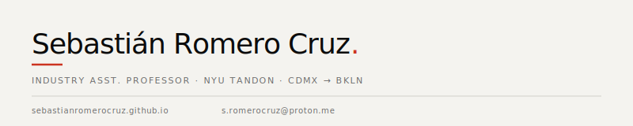

<p align="center">
  
</p>

---

I teach computer science at [NYU Tandon](https://engineering.nyu.edu). Most of my courses live somewhere between programming fundamentals and game engines—Python, C++, data structures, shaders. I'm a little obsessed with learning things.

---

**Teaching**

| | |
|---|---|
| `CS-UY 3113` | [**Intro to Game Programming**](https://github.com/sebastianromerocruz/CS3113-Intro-To-Game-Programming#cs-uy-3113-introduction-to-game-programming) |
| `CS-UY 1134` | [**Data Structures and Algorithms**](https://github.com/sebastianromerocruz/CS1134-data-structures-and-algorithms#cs-uy-1134-material) |
| `CS-UY 1113` | [**Problem Solving & Programming I**](https://github.com/sebastianromerocruz/CS1114-problem-solving-and-programming#cs-uy-1114-material) |

---

**Stack**

`Python` `C++` `C` `Java` `JavaScript` `raylib` `OpenGL` `Unity` `Claude Code`

---

**Languages**

`English` `Español` `日本語 (intermediate)` `Latīna (intermediate)` `Čeština (beginner)` `Nahuatl (beginner)`

---

<sub><sup>

```
;;;;;;;;;;;;;;;;;;;;;;
;; E8 AB B8 E8 A1 8C ;;
;; E7 84 A1 E5 B8 B8 ;;
;;;;;;;;;;;;;;;;;;;;;;
```

</sup></sub>
